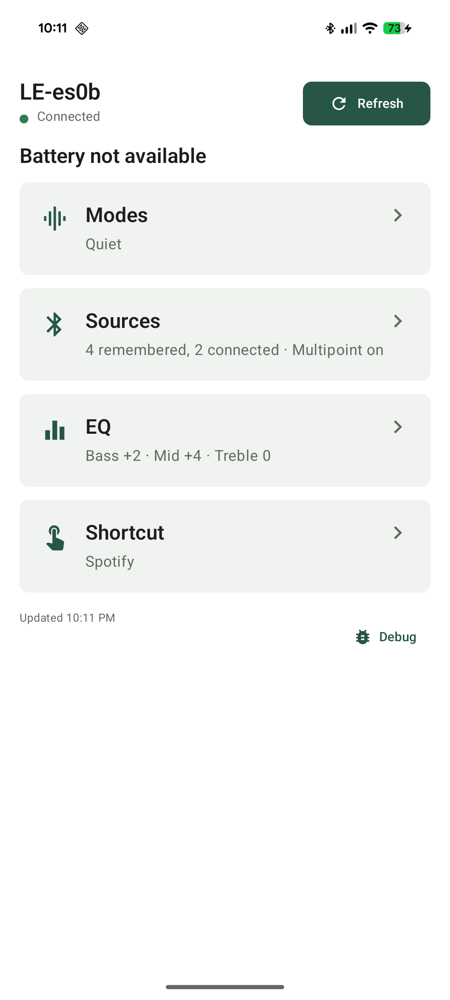
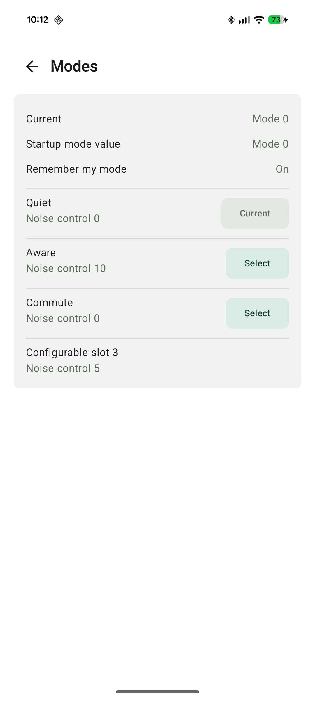
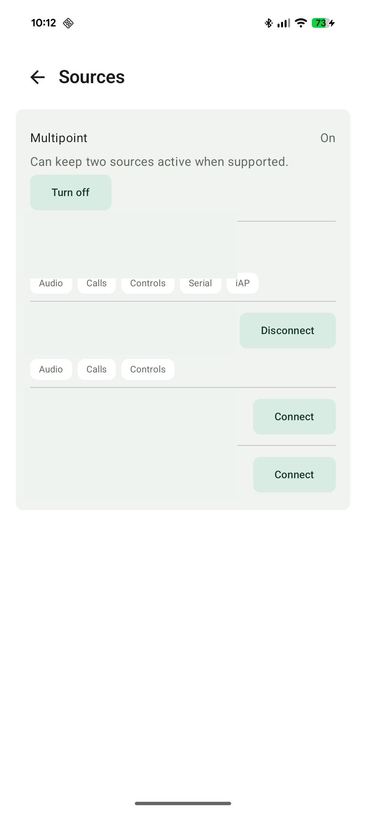

# LibreQC

LibreQC is an Android app and Kotlin protocol toolkit for Bose QuietComfort
headphones. It talks to the headset locally over Bluetooth BMAP, shows a typed
snapshot of headset state, and keeps protocol evidence in-repo.



## Status

LibreQC is experimental. It has hardware-verified controls for mode selection,
EQ adjustment, shortcut assignment, multipoint toggle, and remembered-source
connect/disconnect. Mode editing remains blocked until the `[31.6]` mode-config
write sequence is proven on hardware.

## Features

- Android Compose UI for overview, modes, sources, EQ, shortcut, and
  diagnostics.
- Pure Kotlin/JVM BMAP codec with packet encoding, incremental stream decoding,
  error decoding, correlation, and diagnostics.
- Pure Kotlin/JVM `prince-profile` parsers for battery, EQ, shortcut,
  multipoint, modes, and remembered sources.
- Fixed read probe allowlist and documented hardware verification captures.
- No account, analytics, ads, or network service.

## Screenshots

| Overview | Modes | Sources |
| --- | --- | --- |
|  |  |  |

Documentation:

- [Product functional specification](docs/product-functional-spec.md)
- [Implementation plan](docs/implementation-plan.md)
- [Release checklist](docs/release-checklist.md)
- [Release media guide](docs/release-media.md)
- [Privacy](docs/privacy.md)
- [Stage 2 read-only snapshot plan](docs/stage-2-read-only-snapshot-plan.md)
- [Verified `prince` protocol findings](docs/prince-protocol.md)
- [USB findings on macOS](docs/usb-findings-2026-06-15.md)
- UI reference captures are under `captures/`.
- The redacted Stage 2 baseline is
  `captures/rfcomm-stage2-read-only-2026-06-14.txt`.

The probe:

- Selects a bonded Bluetooth device advertising the Bose BMAP UUID.
- Uses the standard SPP UUID used by Bose Music, with the advertised BMAP
  UUID as a diagnostic fallback.
- Sends only a fixed allowlist of BMAP `GET` packets.
- Logs raw request/response hex and decoded frame headers under
  `LibreQCProbe`.

`bmap-codec` is a pure Kotlin/JVM module containing packet encoding,
incremental stream decoding, error decoding, correlation, and diagnostics.

`prince-profile` is a pure Kotlin/JVM module containing typed parsers for EQ,
Shortcut, multipoint, modes, and remembered sources. It assembles independent
feature results into a capability-aware `DeviceSnapshot`.

The Android app presents a read-only Compose overview with Modes, Source, EQ,
Shortcut, and Diagnostics screens. Its refresh path still sends only the fixed
GET allowlist.

## Build

Tests use frames from redacted RFCOMM captures:

```sh
./gradlew :bmap-codec:test :prince-profile:test \
  :app:testDebugUnitTest :app:assembleDebug
```

Debug APK output:

```text
app/build/outputs/apk/debug/app-debug.apk
```

Tagged GitHub releases run `.github/workflows/release.yml` and upload
`libreqc-debug.apk`. If GitHub Actions is unavailable, build locally and upload
the APK manually.

## Device Run

An explicit device can be selected with the `mac` activity extra. The Stage 2
probe has no state-changing activity extras or packet paths.

```sh
adb shell am start -n dev.libreqc.probe/.MainActivity \
  --es mac AA:BB:CC:DD:EE:FF
adb logcat -s LibreQCProbe:I '*:S'
```

## License

MIT. See [LICENSE](LICENSE).
